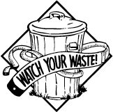

[](https://travis-ci.org/sallareznov/waste-monitor) [](https://www.codacy.com/app/sallareznov/waste-monitor)

# Waste Monitor

<p align="center">
  
</p>

Waste Monitor is an application enabling the user to monitor the evolution of his waste generation.

### Routes

| Route | Verb | Headers | URL Parameters | Body | Description |
| ----- | ---- | ------- | -------------- | ---- | ----------- |
| ```/api/login``` | POST | None | None | ```{ "username" : "john", "password" : "john" }``` | Attempts to log the user |
| ```/api/register``` | POST | None | None | ```{ "username" : "john", "password" : "john" }``` | Attempts to register a new user |
| ```/api/users``` | GET | None | None | None | Lists the registered users |
| ```/api/user``` | GET | ```Authorization: Basic <access_token>``` | None | None | Shows informations about the authenticated user (his username, the number of trashes he owns and the total waste volume that are in his trashes) |
| ```/api/user/trashes``` | GET | ```Authorization: Basic <access_token>``` | None | None | Shows informations about the trashes owned by the authenticated user |
| ```/api/user/createTrash``` | PUT | ```Authorization: Basic <access_token>``` | None | ```{ "volume" : "5", "dumpFrequency" : "10" }``` | Creates a new trash for the authenticated user |
| ```/api/user/deleteTrash``` | DELETE | ```Authorization: Basic <access_token>``` | ```trashId``` : the identifier of the trash | None | Deletes the specified trash owned by the authenticated user |
| ```/api/user/trash``` | GET | ```Authorization: Basic <access_token>``` | ```trashId``` : the identifier of the trash | None | Shows informations about the selected trash owned by the authenticated user |
| ```/api/user/evolution``` | GET | ```Authorization: Basic <access_token>``` | None | None | Shows informations about the evolution of the authenticated user's waste |

### Usage scenario
