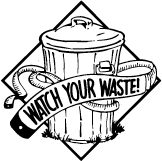
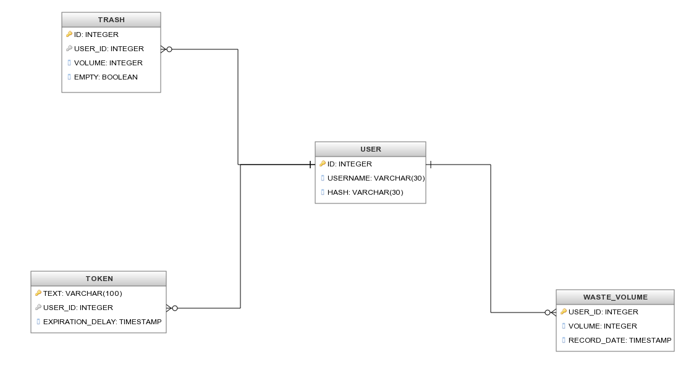
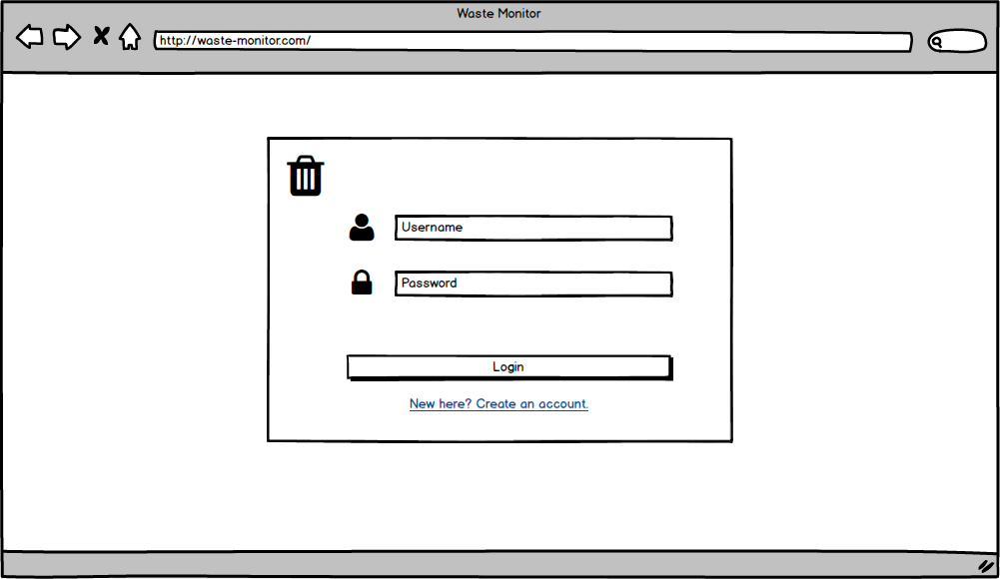
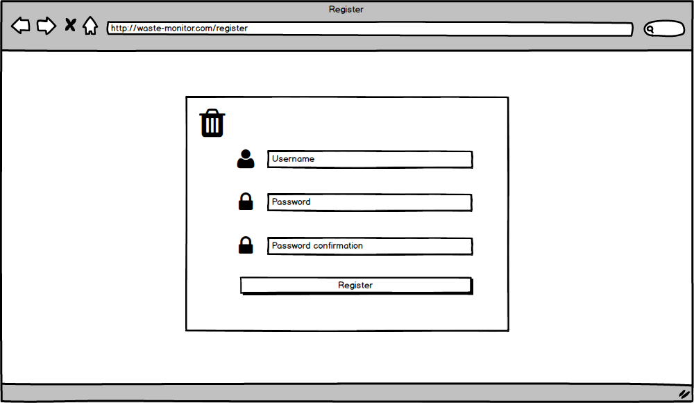
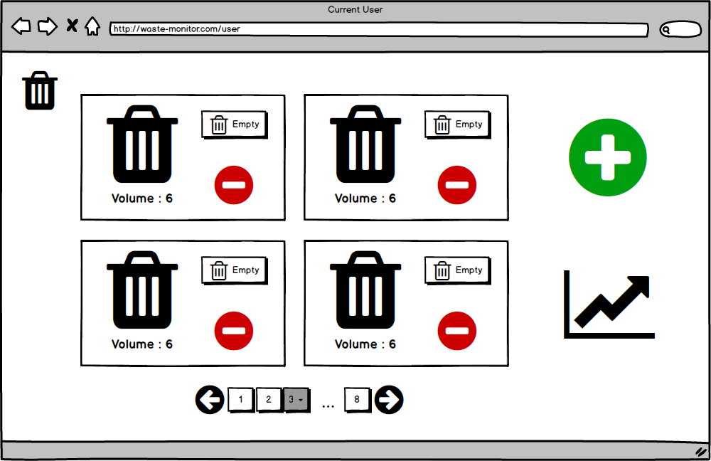
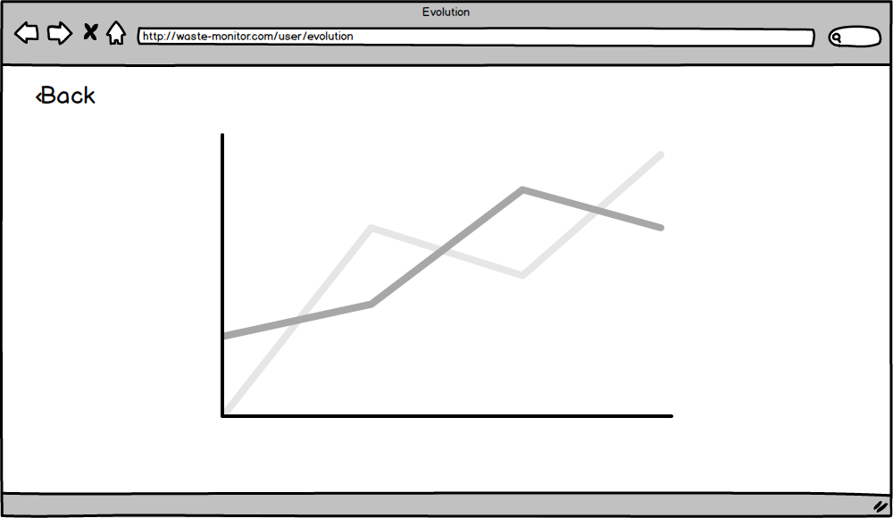

[](https://travis-ci.org/sallareznov/waste-monitor) [](https://www.codacy.com/app/sallareznov/waste-monitor)

# Waste Monitor

<p align="center">
  
</p>

Waste Monitor is a RESTful web service enabling the user to monitor the evolution of his waste generation over time.

### Routes

| Route | Verb | Headers | URL Parameters | Query Parameters | Body | Description | Return codes |
| :---: | :--: | ------- | -------------- | ---------------- | ---- | ----------- | ------------ |
| ```/api``` | GET | None | None | None | None | Displays documentation about all the entry points | <ul><li><b>200 (OK)</b> if the operation proceeded successfully</li><li><b>500 (Internal Server Error)</b> if an error occurred on the server</li></ul> |
| ```/api/register``` | PUT | None | None | None | ```{ "username" : "johndoe", "password" : "johndoe" }``` | Attempts to register a new user | <ul><li><b>201 (Created)</b> if the operation proceeded successfully and the user was created</li><li><b>409 (Conflict)</b> if a user with the same username already exists</li><li><b>500 (Internal Server Error)</b> if an error occurred on the server</li></ul> |
| ```/api/login``` | POST | None | None | None | ```{ "username" : "johndoe", "password" : "johndoe" }``` | Attempts to log a user | <ul><li><b>200 (OK)</b> if the operation proceeded successfully</li><li><b>401 (Unauthorized)</b> if the credentials are invalid</li><li><b>500 (Internal Server Error)</b> if an error occurred on the server</li></ul> |
| ```/api/users``` | GET | None | None | None | None | Lists the registered users | <ul><li><b>200 (OK)</b> if the operation proceeded successfully</li><li><b>500 (Internal Server Error)</b> if an error occurred on the server</li></ul> |
| ```/api/user``` | GET | ```Authorization: Basic <access_token>``` | None | None | None | Shows informations about the authenticated user (his username, the number of trashes he owns and the total waste volume that are in his trashes) | <ul><li><b>200 (OK)</b> if the operation proceeded successfully</li><li><b>400 (Bad Request)</b> if the authentication token wasn't provided</li><li><b>403 (Forbidden)</b> if the authentication token is invalid or has expired</li><li><b>500 (Internal Server Error)</b> if an error occurred on the server</li></ul> |
| ```/api/user/trashes``` | GET | ```Authorization: Basic <access_token>``` | None | None | None | Shows informations about the trashes owned by the authenticated user | <ul><li><b>200 (OK)</b> if the operation proceeded successfully</li><li><b>400 (Bad Request)</b> if the authentication token wasn't provided</li><li><b>403 (Forbidden)</b> if the authentication token is invalid or has expired</li><li><b>500 (Internal Server Error)</b> if an error occurred on the server</li></ul> |
| ```/api/user/createTrash``` | PUT | ```Authorization: Basic <access_token>``` | None | ```volume``` : the volume of the trash | None | Creates a new trash for the authenticated user | <ul><li><b>201 (Created)</b> if the operation proceeded successfully and the trash was created</li><li><b>400 (Bad Request)</b> if the authentication token wasn't provided</li><li><b>403 (Forbidden)</b> if the authentication token is invalid or has expired</li><li><b>500 (Internal Server Error)</b> if an error occurred on the server</li></ul> |
| ```/api/user/trash``` | GET | ```Authorization: Basic <access_token>``` | ```trashId``` : the identifier of the trash | None | None | Shows informations about the selected trash owned by the authenticated user | <ul><li><b>200 (OK)</b> if the operation proceeded successfully</li><li><b>400 (Bad Request)</b> if the authentication token wasn't provided</li><li><b>403 (Forbidden)</b> if the authentication token is invalid or has expired</li><li><b>500 (Internal Server Error)</b> if an error occurred on the server</li></ul> |
| ```/api/user/emptyTrash``` | POST | ```Authorization: Basic <access_token>``` | ```trashId``` : the identifier of the trash | None | None | Empties the specified trash | <ul><li><b>200 (OK)</b> if the operation proceeded successfully</li><li><b>400 (Bad Request)</b> if the authentication token wasn't provided</li><li><b>403 (Forbidden)</b> if the authentication token is invalid or has expired</li><li><b>404 (Not Found)</b> if the trash with the specified id doesn't exist</li><li><b>409 (Conflict)</b> if the trash is already empty</li><li><b>500 (Internal Server Error)</b> if an error occurred on the server</li></ul> |
| ```/api/user/fillTrash``` | POST | ```Authorization: Basic <access_token>``` | ```trashId``` : the identifier of the trash | None | None | Fills the specified trash | <ul><li><b>200 (OK)</b> if the operation proceeded successfully</li><li><b>400 (Bad Request)</b> if the authentication token wasn't provided</li><li><b>403 (Forbidden)</b> if the authentication token is invalid or has expired</li><li><b>404 (Not Found)</b> if the trash with the specified id doesn't exist</li><li><b>409 (Conflict)</b> if the trash is already full</li><li><b>500 (Internal Server Error)</b> if an error occurred on the server</li></ul> |
| ```/api/user/deleteTrash``` | DELETE | ```Authorization: Basic <access_token>``` | ```trashId``` : the identifier of the trash | None | None | Deletes the specified trash owned by the authenticated user | <ul><li><b>200 (OK)</b> if the operation proceeded successfully</li><li><b>400 (Bad Request)</b> if the authentication token wasn't provided</li><li><b>403 (Forbidden)</b> if the authentication token is invalid or has expired</li><li><b>404 (Not Found)</b> if the trash with the specified id doesn't exist</li><li><b>500 (Internal Server Error)</b> if an error occurred on the server</li></ul>  |
| ```/api/user/evolution``` | GET | ```Authorization: Basic <access_token>``` | None | None | None | Shows informations about the evolution of the authenticated user's waste | <ul><li><b>200 (OK)</b> if the operation proceeded successfully</li><li><b>400 (Bad Request)</b> if the authentication token wasn't provided</li><li><b>403 (Forbidden)</b> if the authentication token is invalid or has expired</li><li><b>500 (Internal Server Error)</b> if an error occurred on the server</li></ul> |

### Database model

<p align="center">
  
</p>

### Website mockups

#### Login


#### Register


#### Home page


#### Evolution

